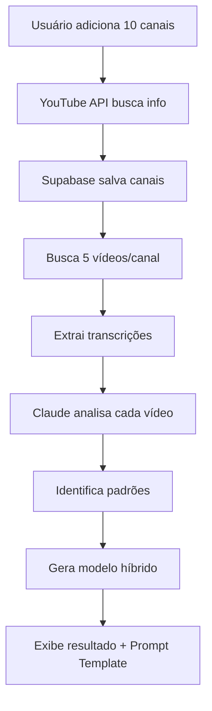

# 🎯 ORYOS 2.0 + Channel Analytics

AI Script Generator with Hybrid Model Creation from YouTube Channel Analysis

## 🚀 Overview

ORYOS é um gerador de roteiros com IA que agora inclui uma poderosa funcionalidade de **análise de canais** para criar modelos híbridos únicos.

### Funcionalidades Principais

#### 1. **Script Generator** (Original)
- Geração de roteiros com IA
- Múltiplos formatos (YouTube, TikTok, Instagram, etc)
- Histórico de roteiros criados

#### 2. **Voice & Style Cloning** (Original)
- Clone seu estilo a partir de 6 vídeos
- Treinamento de tom e ritmo
- Estilos salvos reutilizáveis

#### 3. **Channel Analytics** (NOVO! ✨)
- **Analise 10 canais do YouTube**
- **Crie um modelo híbrido único**
- **Prompt template pronto para usar**

Combina o melhor de 10 canais diferentes em um único modelo de roteiro "Frankenstein Bonitão" que você pode usar em qualquer LLM!

## 🎨 Screenshot


## ⚡ Quick Start

### 1. Clone o Repositório

```bash
git clone https://github.com/uxspideroficial01/ORYOSApp.git
cd ORYOSApp
```

### 2. Instalar Dependências

```bash
npm install
```

### 3. Configurar Variáveis de Ambiente

```bash
cp .env.example .env
```

Edite `.env` e adicione suas keys:

```env
VITE_SUPABASE_URL=https://seu-projeto.supabase.co
VITE_SUPABASE_ANON_KEY=sua_anon_key
VITE_YOUTUBE_API_KEY=sua_youtube_key
VITE_ANTHROPIC_API_KEY=sua_claude_key  # Opcional
```

### 4. Rodar o Projeto

```bash
npm run dev
```

Acesse http://localhost:5173

## 📖 Documentação Completa

Para configuração detalhada da funcionalidade Channel Analytics, veja:

**[📚 CHANNEL_ANALYTICS_SETUP.md](./CHANNEL_ANALYTICS_SETUP.md)**

## 🎯 Como Funciona

### Fluxo da Análise de Canais



### O que o Modelo Híbrido Analisa

1. **Estrutura de Roteiro**
   - Duração de intro
   - Tipo de gancho (hook)
   - Estrutura do desenvolvimento
   - Tipo de conclusão e CTA

2. **Tom e Estilo**
   - Formalidade (0-10)
   - Energia (0-10)
   - Nível emocional (0-10)
   - Nível técnico (0-10)
   - Linguagem característica

3. **Padrões de Conteúdo**
   - Uso de storytelling
   - Frequência de exemplos
   - Uso de dados/estatísticas
   - Formato predominante

4. **Técnicas Narrativas**
   - Perguntas retóricas
   - Storytelling pessoal
   - Analogias e metáforas
   - Repetição para ênfase
   - Contraste e comparação
   - Elementos de surpresa

## 🛠 Tech Stack

- **Frontend:** React 19 + TypeScript
- **Build:** Vite 7
- **Styling:** Tailwind CSS 4
- **Icons:** Lucide React
- **Database:** Supabase (PostgreSQL)
- **Auth:** Supabase Auth
- **APIs:**
  - YouTube Data API v3
  - Anthropic Claude API (opcional)

## 📁 Estrutura do Projeto

```
ORYOSApp/
├── src/
│   ├── components/
│   │   ├── analytics/          # 🆕 Channel Analytics
│   │   │   ├── ChannelAnalyticsPage.tsx
│   │   │   ├── ChannelCard.tsx
│   │   │   ├── AnalyticsTips.tsx
│   │   │   └── HybridModelView.tsx
│   │   ├── cloning/            # Voice & Style Cloning
│   │   ├── home/               # Script Generator
│   │   ├── history/            # Script History
│   │   └── ...
│   ├── services/               # 🆕 API Services
│   │   └── youtube.service.ts
│   ├── types/                  # 🆕 TypeScript Types
│   │   └── analytics.ts
│   ├── lib/                    # 🆕 Utilities
│   │   └── supabase.ts
│   └── ...
├── supabase-schema.sql         # 🆕 Database Schema
├── CHANNEL_ANALYTICS_SETUP.md  # 🆕 Setup Guide
└── package.json
```

## 🚀 Deploy

### Vercel

```bash
npm i -g vercel
vercel
```

### Netlify

```bash
npm i -g netlify-cli
netlify deploy --prod
```

**⚠️ Importante:** Configure as variáveis de ambiente no dashboard!

## 📊 Exemplo de Uso

### 1. Adicione 10 Canais

```
1. https://youtube.com/@mkbhd
2. https://youtube.com/@LinusTechTips
3. https://youtube.com/@Fireship
4. https://youtube.com/@ThePrimeagen
5. https://youtube.com/@CodigoFonteTV
6. ... (mais 5 canais)
```

### 2. Gere o Modelo Híbrido

Clique em **"Gerar Modelo Híbrido"** e aguarde ~15 minutos.

### 3. Use o Prompt Template

Copie o prompt template gerado e use em qualquer LLM:

```
[Prompt template gerado pelo sistema]

Agora crie um roteiro sobre: "Top 5 celulares de 2024"
```

O LLM vai gerar um roteiro seguindo o estilo híbrido descoberto! 🎉

## 💡 Use Cases

### Para Criadores de Conteúdo
- Analise seus concorrentes
- Descubra padrões que funcionam
- Crie roteiros otimizados

### Para Agências
- Crie modelos para cada cliente
- Padronize produção de conteúdo
- Acelere criação de roteiros

### Para Marcas
- Entenda o tom do seu nicho
- Crie conteúdo alinhado com o mercado
- Teste diferentes estilos

## 🤝 Contribuindo

Contribuições são bem-vindas! Para grandes mudanças:

1. Fork o projeto
2. Crie uma branch (`git checkout -b feature/AmazingFeature`)
3. Commit suas mudanças (`git commit -m 'Add some AmazingFeature'`)
4. Push para a branch (`git push origin feature/AmazingFeature`)
5. Abra um Pull Request

## 📝 Changelog

### [2.0.0] - 2026-01-14

#### Added
- ✨ **Channel Analytics** - Análise de 10 canais do YouTube
- 🎯 **Hybrid Model Generator** - Modelo único combinando múltiplos canais
- 📊 **Rich Visualization** - Gráficos e métricas detalhadas
- 📋 **Prompt Template** - Template pronto para usar
- 💾 **Export JSON** - Exportar modelo completo
- 🔗 **YouTube Integration** - YouTube Data API v3
- 🗄️ **Supabase Integration** - Database e auth
- 📚 **Complete Documentation** - Guia de setup detalhado

### [1.0.0] - 2026-01-11

#### Initial Release
- Script Generator
- Voice & Style Cloning
- History Management
- Settings Page

## 📄 Licença

MIT License - veja [LICENSE](LICENSE) para detalhes.

## 🙏 Créditos

- Design inspirado no Lovable
- Icons by [Lucide](https://lucide.dev)
- Powered by [Anthropic Claude](https://anthropic.com)
- Built with [React](https://react.dev) + [Vite](https://vitejs.dev)

## 📧 Contato

- GitHub: [@uxspideroficial01](https://github.com/uxspideroficial01)
- Issues: [GitHub Issues](https://github.com/uxspideroficial01/ORYOSApp/issues)

---

**Feito com ❤️ para criadores de conteúdo**

*Transforme análise de canais em roteiros incríveis!*
